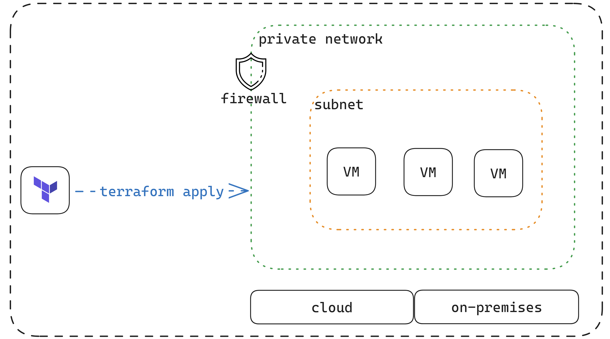
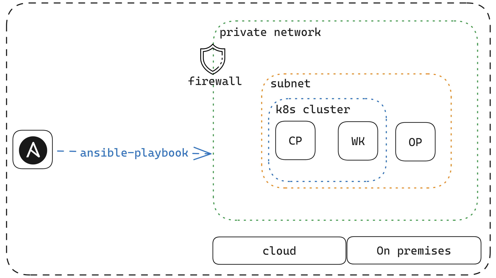

# gitOps LCM of 5G k8s Infra

## Tools used

- Windows Subsystem for Linux (WSL)
- Version control system git
- Terraform
- Ansible
- Docker
- Kubernetes
- Cillium CNI
- Flux CD gitops tool

## Deployment/ Installation Guide

## Pre-requisities

- Windows Subsystem for Linux (WSL) installed
- Visual Studio Code and extension packs are installed and configured for the Ansible development environment.
- python3 python3-venv python3-ldap installed
- pip3 installed
- In the Python virtual environment, the required packages are installed
- Terraform installed
- Target cloud OR/AND on-premises infrastructures configured for access from WSL in order to use Terrafom
- WSL Linux configured with git
- Generated git PAT available to use
- Slack Incoming Webhook URL configured and available

## Infrastructure as Code (IaC) : Terraform


*Figure 1 : IaC using Terraform*

> IaC, CaC, and other refferences of source code -

- Clone this repo [gitops-poc ](https://github.com/gitops-lcm/gitops-poc.git)

**1.** Using WSL ``terminal`` navigate to the project root directory -

> Initialize Terraform in the directory -

```
terraform init
```

> To ``create`` using terraform commands -

```
terraform validate
```

```
terraform plan
```

```
terraform apply
```

> A successful ``create`` will have output with all VMs IP addresses.

> To ``destroy`` using terraform commands -

```
terraform destroy
```

## Configuration as Code (CaC) : Ansible


*Figure 2 : CaC using Ansible*

**2.** Connect all VMs using SSH to prepare for Ansible configuration access - 

```
ssh ssh-user@<ip address of VM>
```

> **Important:** Update ``ansible_host`` of ansible ``inventory`` file with target VMs IP addresses.

**3.** To prepare and configure k8s cluster - 

>**Important:** Run below Ansible commands from activated python virtual environment which having all required packages installed. (ref: ``requirements.txt``)
```
ansible-playbook k8s_playbook.yaml
```
**4.** To prepare and configure flux ops - 
```
ansible-playbook ops_playbook.yaml
```
**5.** To configure notification and alert - 
```
ansible-playbook notify_playbook.yaml
```

## gitOps in practice : Flux (gotk)


*Figure 3 : gitOps using Flux gtok*

> Flux systems repo created by flux during previous configuration phase -
  
- Clone the repo [flux-infra ](https://github.com/gitops-lcm/flux-infra.git)

> Copy ``monitoring`` folder from ``gitops-poc/resources/monitoring`` to ``flux-infra/``. Monitoring folder content open source monitoring tools of prometheus & grafana stack helm deployments. 

```
cp -r ~/gitops-poc/resources/monitoring ~/flux-infra
```

> Copy flux operator related CRDs ``monitoring.yaml``, ``slack_alert_provider.yaml`` ,``slack_alert.yaml``, and ``xyz_git_src.yaml`` files from ``gitops-poc/resources/crds/fluxops``to ``flux-infra/clusters/ops/`` . Push locally updated ``flux-infra`` with ops CRDs to ``main`` branch of remote git repository. 

```
git add .
```

```
git commit -m "updated flux ops crds"
```

```
git push origin main
```

> Similarly place all your deployment CRDs at ``flux-infra/clusters/ops/`` and push locally updated ``flux-infra`` with deployment CRDs to ``main`` branch of remote git repository.

```
cp ~/gitops-poc/resources/crds/deploy/* ~/flux-infra/clusters/ops/
```

```
git add .
```

```
git commit -m "updated deployment crds"
```

```
git push origin main
```

> ``patch``  required services / deployments.

To ``patch`` **kube-prometheus-stack-grafana** services for dashboard access -

```
ansible-playbook patch_playbook.yaml
```

> Below is the project delivery directory structure to refer. 
```
.
├── ansible.cfg
├── inventory.ini
├── k8s_playbook.yaml
├── main.tf
├── notify_playbook.yaml
├── ops_playbook.yaml
├── patch_playbook.yaml
├── README.md
├── requirements.txt
├── resources
│   ├── CaC.png
│   ├── crds
│   │   ├── deploy
│   │   │   ├── xyz_kust_db.yaml
│   │   │   ├── xyz_kust_redis.yaml
│   │   │   ├── xyz_kust_result.yaml
│   │   │   ├── xyz_kust_vote.yaml
│   │   │   └── xyz_kust_worker.yml
│   │   └── fluxops
│   │       ├── monitoring.yaml
│   │       ├── slack_alert_provider.yaml
│   │       ├── slack_alert.yaml
│   │       └── xyz_git_src.yaml
│   ├── gitOps.png
│   ├── gitops-poc-1-0b406afbb75c.json
│   ├── IaC.png
│   └── monitoring
│       ├── configs
│       │   ├── dashboards
│       │   │   ├── cluster.json
│       │   │   ├── control-plane.json
│       │   │   └── logs.json
│       │   ├── kustomization.yaml
│       │   └── podmonitor.yaml
│       └── controllers
│           ├── kube-prometheus-stack
│           │   ├── kube-state-metrics-config.yaml
│           │   ├── kustomization.yaml
│           │   ├── kustomizeconfig.yaml
│           │   ├── namespace.yaml
│           │   ├── release.yaml
│           │   └── repository.yaml
│           └── loki-stack
│               ├── kustomization.yaml
│               ├── release.yaml
│               └── repository.yaml
└── roles
    ├── k8s
    │   ├── defaults
    │   │   └── main.yml
    │   ├── files
    │   │   ├── cilium-cni.yaml
    │   │   └── kubeadm-config.yaml
    │   ├── handlers
    │   │   └── main.yml
    │   ├── meta
    │   │   └── main.yml
    │   ├── README.md
    │   ├── tasks
    │   │   ├── cluster_cilium.yaml
    │   │   ├── cluster_init.yaml
    │   │   ├── cluster_install.yaml
    │   │   ├── cluster_join.yaml
    │   │   ├── cluster_key.yaml
    │   │   ├── cluster_prep.yaml
    │   │   ├── cluster_user.yaml
    │   │   └── main.yml
    │   ├── templates
    │   ├── tests
    │   │   ├── inventory
    │   │   └── test.yml
    │   └── vars
    │       └── main.yml
    ├── notify
    │   ├── defaults
    │   │   └── main.yml
    │   ├── files
    │   ├── handlers
    │   │   └── main.yml
    │   ├── meta
    │   │   └── main.yml
    │   ├── README.md
    │   ├── tasks
    │   │   ├── k8s_secret.yaml
    │   │   └── main.yml
    │   ├── templates
    │   ├── tests
    │   │   ├── inventory
    │   │   └── test.yml
    │   └── vars
    │       └── main.yml
    ├── ops
    │   ├── defaults
    │   │   └── main.yml
    │   ├── files
    │   ├── handlers
    │   │   └── main.yml
    │   ├── meta
    │   │   └── main.yml
    │   ├── README.md
    │   ├── tasks
    │   │   ├── config_flux.yaml
    │   │   ├── config_git.yaml
    │   │   ├── config_k8s.yaml
    │   │   ├── docker_clean.yaml
    │   │   ├── docker_hello.yaml
    │   │   ├── docker_init.yaml
    │   │   ├── flux_bootstrap.yaml
    │   │   ├── k8s_client.yaml
    │   │   └── main.yml
    │   ├── templates
    │   ├── tests
    │   │   ├── inventory
    │   │   └── test.yml
    │   └── vars
    │       └── main.yml
    └── patch
        ├── defaults
        │   └── main.yml
        ├── files
        ├── handlers
        │   └── main.yml
        ├── meta
        │   └── main.yml
        ├── README.md
        ├── tasks
        │   ├── flux_monitor.yaml
        │   └── main.yml
        ├── templates
        ├── tests
        │   ├── inventory
        │   └── test.yml
        └── vars
            └── main.yml

48 directories, 87 files
```
